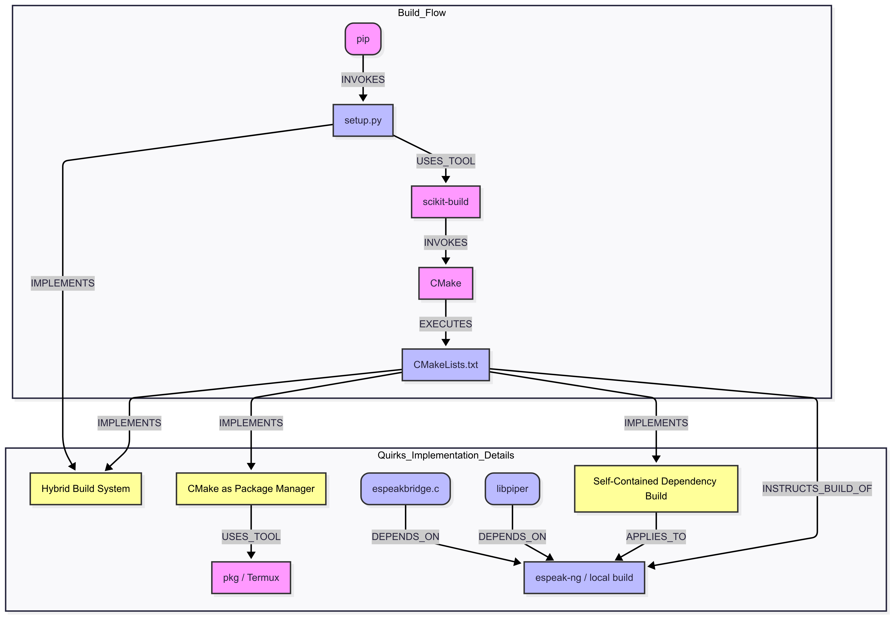

# Piper TTS (Termux Fork) Build Guide


Piper is a high-quality, open-source text-to-speech (TTS) system that runs entirely on your local device. It's designed for performance and privacy, making it an excellent choice for applications requiring voice output without relying on cloud services.

This fork is specifically optimized to ensure a smooth and reliable build experience on Termux (Android).

Update 1: 

95% of the files work has been done (80 percent thereof by https://github.com/google-gemini/gemini-cli/, granted) and we are wrapping up our bespoke `CmakeList.txt` into its original by now. The code compiles as such. 

Update 2: 

100 percent done, including the pesky CmakeList.txt, just 10 minutes later. Close to magic... 

Update 3:

We have just learnt what `pytest` may do, doing just that... 


## 🚀 Quick Start (Recommended Method)

### Prerequisites

Ensure you have the necessary build tools installed:

```bash
pkg update && pkg install build-essential cmake git ninja-build
```

### Installation

With the prerequisites in place, you can install the `piper-tts` package directly from this repository:

```bash
pip install .
```

This single command handles the download, compilation, and installation of all dependencies. For detailed build information, see the [docs/BUILDING.md](docs/BUILDING.md) file.

---

**The original, manual build guide and usage examples are preserved below for reference.**

---


---


---


## 🗣️ Usage

Once the package is installed, you can use Piper from the command line.

First, download a voice model if you haven't already:
```bash
python3 -m piper.download_voices
```

### Command Line Options

```
Usage:
  python3 -m piper [OPTIONS] [-- TEXT]
  echo "TEXT" | python3 -m piper [OPTIONS]

Description:
  piper is a lightweight text-to-speech (TTS) command-line interface
  for Termux using Piper and eSpeak-ng.

Options:
  -m, --model MODEL_NAME
        Name of the ONNX voice model to use (without .onnx extension).
        This option is required.

  -f, --file OUTPUT_FILE
        Write synthesized audio to the given file (RAW format).
        Default: 'output.raw' if this option is used without a file name.

  --output-raw -
        Write audio output to standard output (stdout).
        This allows piping to audio players like 'play' or 'aplay'.

  -- TEXT
        Input text to synthesize. If not provided, text will be read from stdin.
```

### Examples

1.  **Read text from clipboard and play output (requires `sox` package):**

    ```bash
    termux-clipboard-get | python3 -m piper --model en_US-lessac-medium --output-raw | play -t raw -r 22050 -e signed-integer -b 16 -c 1 -
    ```

2.  **Write audio to a file:**

    ```bash
    python3 -m piper -m fa_IR-gyro-medium -f output.raw -- "سلام دنیا"
    ```

3.  **Use default output file (output.raw) with stdin:**

    ```bash
    echo "Hello world" | python3 -m piper -m en_US-mlm -f
    ```

### Environment Variables

The `piper` command-line interface and Python API can be configured with the following environment variables:

| Variable | Description |
|---|---|
| `PIPER_VOICE_PATH` | Path to the directory containing your downloaded voice models (.onnx and .onnx.json files). If not set, Piper will search in the current directory. |
| `ESPEAK_DATA_PATH` | Path to the `espeak-ng-data` directory. This is usually handled automatically if `espeak-ng` is installed correctly via `pkg`. You only need to set this if you are using a custom location for the espeak data. |

### Notes

- Output is always in 32-bit float RAW format at 22050Hz, mono.
- When using `--output-raw -`, the output can be piped directly to 'play' or other audio tools.
- This CLI is designed for use within Termux and supports local model/data directories.

## 🛠️ Building from Source & Development

For detailed instructions on building from source, setting up a development environment, or troubleshooting the build process, please refer to our comprehensive guide:

*   **[📄 docs/BUILDING.md](docs/BUILDING.md)**



This document provides a deep dive into the build architecture, including the automated `CMake` process and manual verification steps.
 
