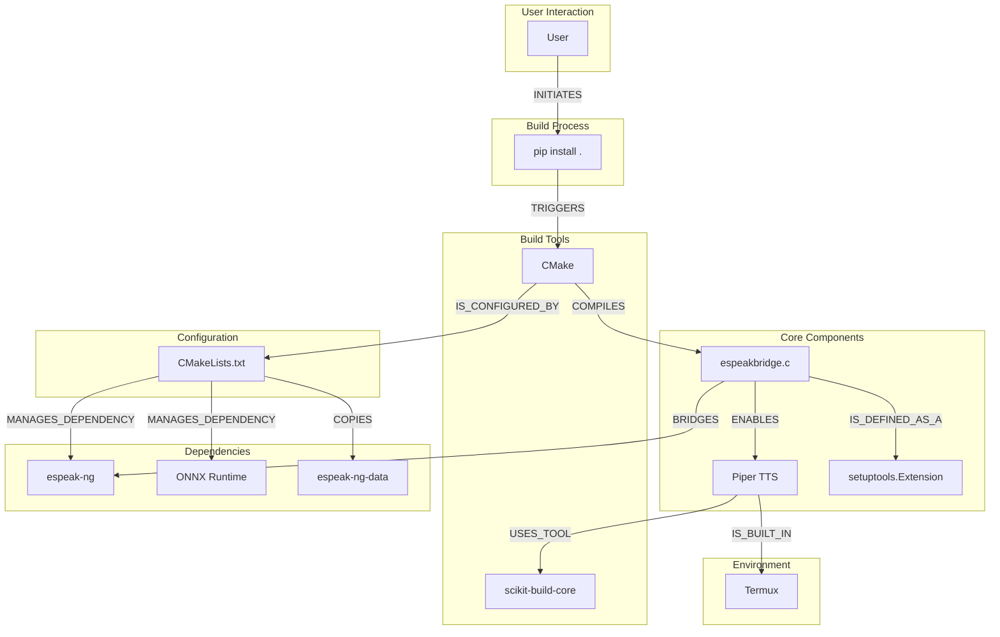

# Knowledge Graph

```mermaid
graph TD
    subgraph "User Interaction"
        User
    end

    subgraph "Build Process"
        A["pip install ."]
    end

    subgraph "Build Tools"
        B[CMake]
        C[scikit-build-core]
    end

    subgraph "Configuration"
        D["CMakeLists.txt"]
    end

    subgraph "Core Components"
        E["Piper TTS"]
        F["espeakbridge.c"]
        G["setuptools.Extension"]
    end

    subgraph "Dependencies"
        H["espeak-ng"]
        I["ONNX Runtime"]
        J["espeak-ng-data"]
    end

    subgraph "Environment"
        K[Termux]
    end

    User -- "INITIATES" --> A
    A -- "TRIGGERS" --> B
    B -- "IS_CONFIGURED_BY" --> D
    D -- "MANAGES_DEPENDENCY" --> H
    D -- "MANAGES_DEPENDENCY" --> I
    D -- "COPIES" --> J
    B -- "COMPILES" --> F
    F -- "IS_DEFINED_AS_A" --> G
    F -- "BRIDGES" --> H
    F -- "ENABLES" --> E
    E -- "IS_BUILT_IN" --> K
    E -- "USES_TOOL" --> C
```
